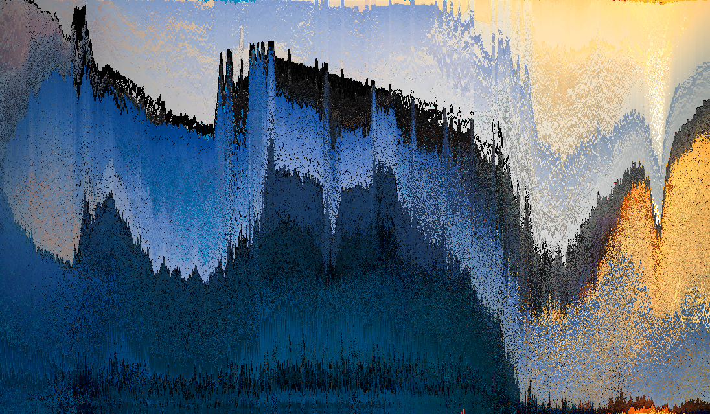

**pixelsorting-cli** is a CLI that grants easy-to-use **cross-platform** access to various functionalities related to the pixelsorting of **images** and **videos**.  
The project offers **masking**, **directional** sorting, **brightness**, **hue** and **saturation** selection as well as **multi-channel support** for videos.

# Examples

# Installation

## Linux

If not already, install **gcc**, **git** and **make**:

### Ubuntu/Debian

    sudo apt install gcc git make

### Fedora

    sudo dnf install gcc git make

### Arch

    sudo pacman -S gcc git make

Clone the repository:

    git clone https://github.com/bennior/pixelsorting-cli
    cd pixelsorting-cli

Build the executable with make:

    make
    sudo make install

The executable will be installed to **/usr/local/bin** and the dependencies to **/usr/local/lib**. The install path can be changed by setting the variable **INSTALL_PREFIX**. To execute the program add **/usr/local/lib** or your location to the **LD_LIBRARY_PATH**:

    export LD_LIBRARY_PATH=/usr/local/lib

The program can be uninstalled by typing:

    sudo make uninstall

## Windows

The project provides **64-Bit Windows** support only.

On Windows the project is built using **cmake**, **git** and **mingw-w64**. Therefore download **cmake** and **git** and install the latest release of **mingw-w64** from [WinLibs](https://winlibs.com). Extract the downloaded **.zip** or **.7z** file and add **mingw64/bin** to your path. Alternative pre-builds of **mingw-w64** can be found on the official website [mingw-w64](https://mingw-w64.org). 

Clone the repository:

    git clone https://github.com/bennior/pixelsorting-cli
    cd pixelsorting-cli

Build the project using **cmake** and **mingw-w64**:

    mkdir build
    cd build
    cmake .. -G "MinGW Makefiles"
    cmake --build .
    cmake --install .

The executable will be installed to **C:/Program Files (x86)/pixelsort**. Make sure to add its location to your path in order to execute the program.

# Usage

The user always needs to specify an input and output file:

    pixelsort -i [INPUT] -o [OUTPUT]
    pixelsort --input=[INPUT] --output=[OUTPUT]

Specifying horizontal or vertical sorting:

    -R, --rows
    -C, --columns

Sort pixels by hue, saturation or brightness:

    -H, --hue
    -S, --saturation
    -B, --brightness

Enable or disable masking:

    -m, --disable-mask
    -M, --enable-mask

Necessary flag when sorting videos:

    -V, --video

For further details on the usage type:

    pixelsort --help

# Dependencies

**cargs** is a C/C++ command line parser: [cargs](https://likle.github.io/cargs/)

**stb image** is a single-file tool for reading and writing images: [stbi](https://github.com/nothings/stb)

**FFMPEG** is an open-source library that provides functionality for multimedia processing: [FFMPEG](https://ffmpeg.org/)

**x264** is a free and open-source encoder: [x264](https://github.com/mirror/x264)

# License

This project is **GPLv2**-licensed. Refer to the **LICENSE.md** for detailed information.
